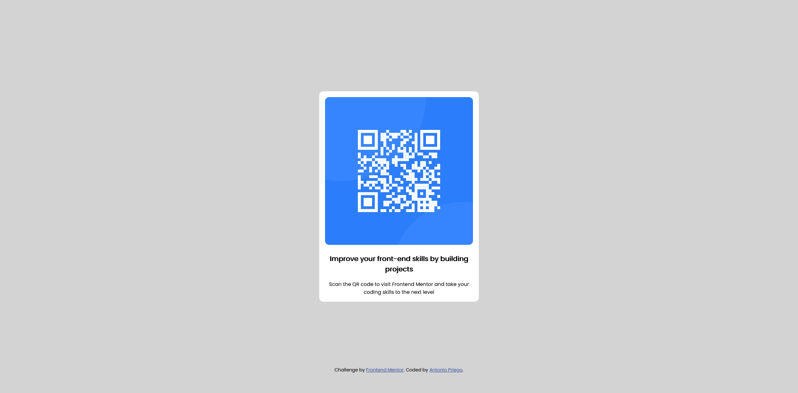
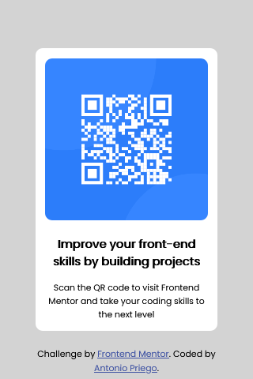

# Simple QR Scanner App; Frontend Mentor Challenge

This is a solution to the [QR code component challenge on Frontend Mentor](https://www.frontendmentor.io/challenges/qr-code-component-iux_sIO_H).

## Index

- [Overview](#overview)
  - [Screenshot](#screenshot)
  - [Links](#links)
- [My Process](#myProcess)
  - [Technologies](#technologies)
  - [What I learnt](#learnt)
- [Author](#author)

## Overview

### Screenshot
First of all, this is how the design looks on my regular 4:3 monitor:

And then, what it would look like on a smaller device:

### Links

- Live Site URL: [https://apriego87-qrcode.netlify.app/]

