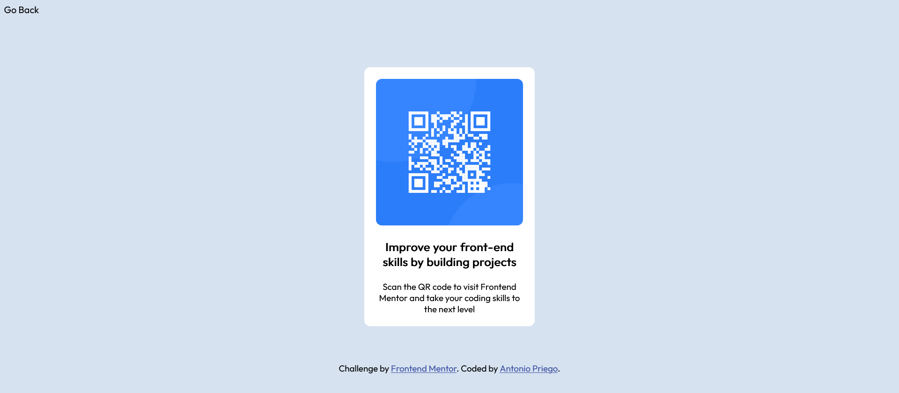
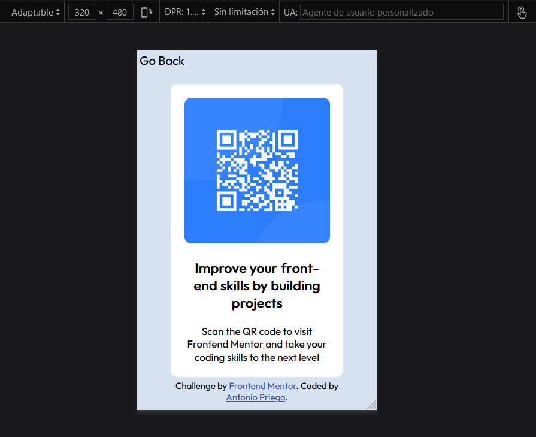

# Simple QR Scanner App; Frontend Mentor Challenge

This is a solution to the [QR code component challenge on Frontend Mentor](https://www.frontendmentor.io/challenges/qr-code-component-iux_sIO_H).

## Index

- [Overview](#overview)
  - [Screenshot](#screenshot)
  - [Links](#links)
- [My Process](#myProcess)
  - [Technologies](#technologies)
  - [What I learnt](#learnt)
- [Author](#author)

## Overview

### Screenshot

First of all, this is how the design looks on my regular 4:3 monitor:

And then, what it would look like on a smaller device:  

### Links

- Live Site URL: [https://apriego87-frontmentor.netlify.app/qrapp/]

## My Process

### Built with

- HTML5
- CSS3
- FlexBox

### What I learnt

- That is not always necessary to set a width / height for DIVs (I used to set it every time).

## Author

- Website - [Antonio Priego](https://apriego87-frontmentor.netlify.app/)
- Frontend Mentor - [@apriego87](https://www.frontendmentor.io/profile/apriego87)
- Twitter - [@apriego87](https://www.twitter.com/apriego87)
